# 📊 Norton E-Library — Architecture & Design Diagrams

> **Version:** 2.0  
> **Created:** April 2, 2026  
> **Last Updated:** May 13, 2026  
> **Based on:** [PRD.md](PRD.md) · [PLAN.md](PLAN.md)  
> **Rendering:** [Mermaid](https://mermaid.js.org) — use GitHub, VS Code Mermaid Preview, or any Mermaid-compatible viewer.

---

## Table of Contents

1. [System Architecture Overview](#1-system-architecture-overview)
2. [Deployment Architecture](#2-deployment-architecture)
3. [Entity-Relationship Diagram](#3-entity-relationship-diagram)
4. [Authentication — Token Flow](#4-authentication--token-flow)
5. [Password Reset — OTP Flow](#5-password-reset--otp-flow)
6. [RBAC Authorization Flow](#6-rbac-authorization-flow)
7. [File Upload & Storage Flow](#7-file-upload--storage-flow)
8. [PDF Reading Flow](#8-pdf-reading-flow)
9. [AI Recommendation Flow](#9-ai-recommendation-flow)
10. [API Route Structure](#10-api-route-structure)
11. [Admin Dashboard — Page Structure](#11-admin-dashboard--page-structure)
12. [Student Frontend — Page Structure](#12-student-frontend--page-structure)
13. [Redux State Architecture](#13-redux-state-architecture)
14. [Sprint & Phase Timeline](#14-sprint--phase-timeline)
15. [Data Flow — Book CRUD](#15-data-flow--book-crud)
16. [Two-Factor Authentication Flow](#16-two-factor-authentication-flow)
17. [Reviews & Feedback Flow](#17-reviews--feedback-flow)
18. [Use Case Diagram](#18-use-case-diagram)
19. [DFD Level 0 — Context Diagram](#19-dfd-level-0--context-diagram)

---

## 1. System Architecture Overview

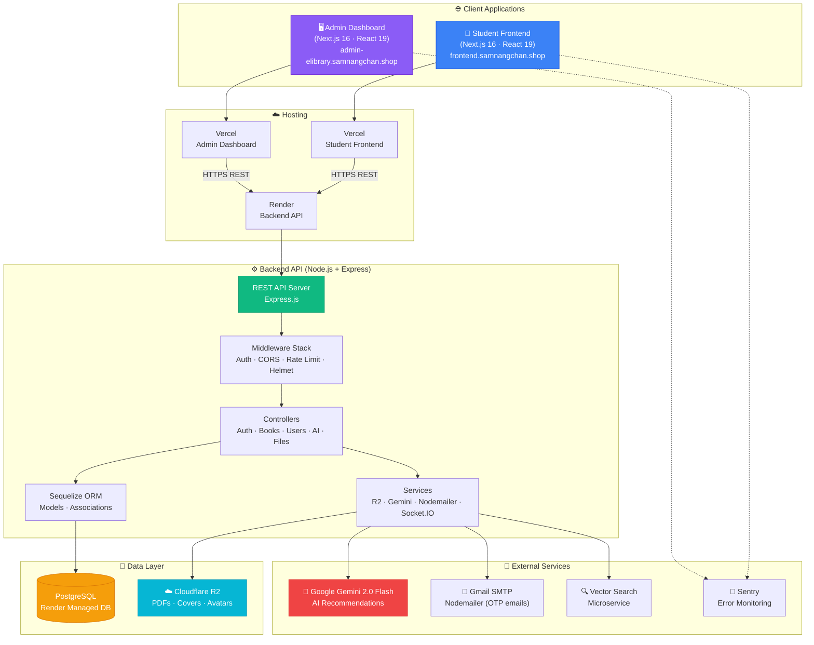

---

## 2. Deployment Architecture

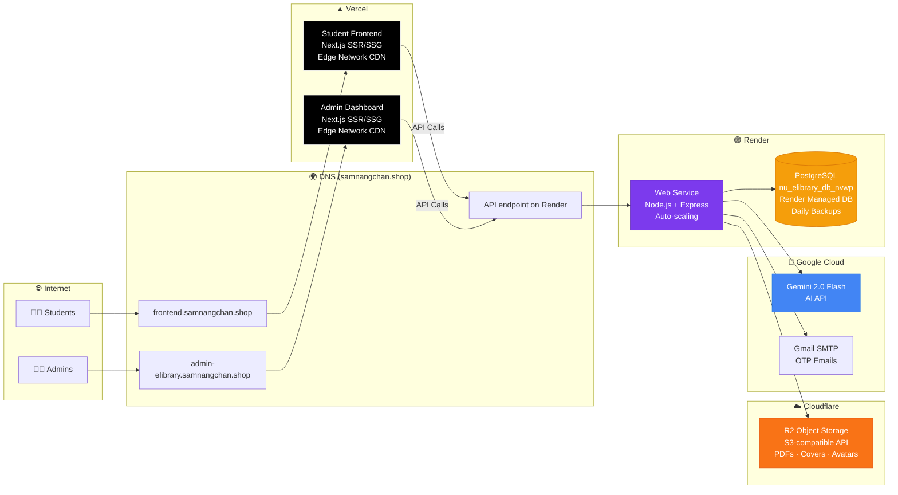

---

## 3. Entity-Relationship Diagram

```mermaid
erDiagram
    User {
        bigint id PK
        string avatar
        string username UK
        string email UK
        string password
        string student_id UK
        string first_name
        string last_name
        boolean is_active
        boolean is_deleted
        datetime created_at
        datetime updated_at
    }

    Role {
        bigint id PK
        string name UK
        string description
    }

    Permission {
        bigint id PK
        string name UK
        string description
    }

    Book {
        bigint id PK
        string title
        string title_kh
        string isbn UK
        text description
        int publication_year
        int pages
        string cover_url
        string pdf_url
        int views
        int downloads
        int publisher_id FK
        int category_id FK
        int department_id FK
        int type_id FK
        boolean is_active
        boolean is_deleted
        datetime created_at
        datetime updated_at
    }

    Author {
        bigint id PK
        string name
        string name_kh
        text biography
        string website
    }

    Editor {
        bigint id PK
        string name
        string name_kh
        text biography
        string website
    }

    Publisher {
        int id PK
        string name
        string name_kh
        text address
        string contact_email
    }

    Category {
        int id PK
        string name UK
        string name_kh
        text description
    }

    Department {
        int id PK
        string code UK
        string name
        string name_kh
        text description
    }

    MaterialType {
        int id PK
        string name UK
        string name_kh
        text description
    }

    Download {
        bigint id PK
        bigint user_id FK
        bigint book_id FK
        datetime downloaded_at
        string ip_address
    }

    Review {
        bigint id PK
        bigint book_id FK
        bigint user_id FK
        int rating
        text comment
        boolean is_deleted
        datetime created_at
        datetime updated_at
    }

    Activity {
        bigint id PK
        bigint user_id FK
        string action
        bigint target_id
        string target_name
        string target_type
        json metadata
        datetime created_at
    }

    Setting {
        string key PK
        text value
        string group
        string type
        datetime created_at
        datetime updated_at
    }

    Feedback {
        bigint id PK
        bigint user_id FK
        enum type
        string subject
        text message
        string name
        string email
        int rating
        datetime created_at
        datetime updated_at
    }

    PushSubscription {
        bigint id PK
        bigint user_id FK
        text endpoint UK
        json keys
        datetime created_at
        datetime updated_at
    }

    %% Junction Tables
    UsersRoles {
        bigint user_id FK
        bigint role_id FK
    }

    RolesPermissions {
        bigint role_id FK
        bigint permission_id FK
    }

    UsersPermissions {
        bigint user_id FK
        bigint permission_id FK
    }

    BooksAuthors {
        bigint book_id FK
        bigint author_id FK
        boolean is_primary_author
    }

    BooksEditors {
        bigint book_id FK
        bigint editor_id FK
    }

    PublishersBooks {
        bigint publisher_id FK
        bigint book_id FK
    }

    %% Relationships
    User ||--o{ UsersRoles : "has"
    Role ||--o{ UsersRoles : "assigned to"
    Role ||--o{ RolesPermissions : "grants"
    Permission ||--o{ RolesPermissions : "granted by"
    User ||--o{ UsersPermissions : "has direct"
    Permission ||--o{ UsersPermissions : "assigned to"

    Book ||--o{ BooksAuthors : "written by"
    Author ||--o{ BooksAuthors : "writes"
    Book ||--o{ BooksEditors : "edited by"
    Editor ||--o{ BooksEditors : "edits"
    Book ||--o{ PublishersBooks : "published by"
    Publisher ||--o{ PublishersBooks : "publishes"

    Book }o--|| Category : "belongs to"
    Book }o--|| Department : "belongs to"
    Book }o--|| MaterialType : "classified as"

    User ||--o{ Download : "downloads"
    Book ||--o{ Download : "downloaded in"

    User ||--o{ Review : "writes"
    Book ||--o{ Review : "reviewed in"

    User ||--o{ Activity : "performs"
    User ||--o{ Feedback : "submits"
    User ||--o{ PushSubscription : "subscribes"
```

---

## 4. Authentication — Token Flow

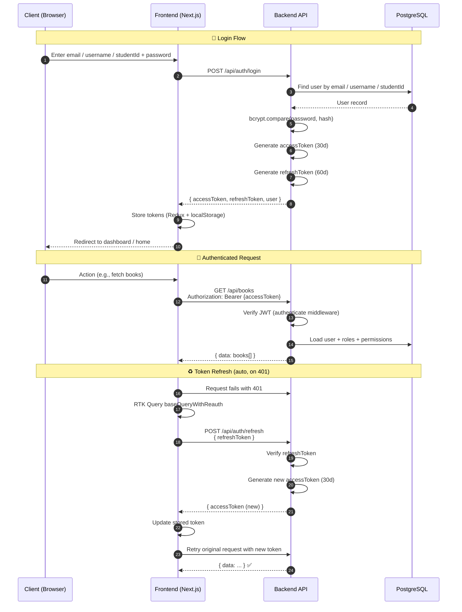

---

## 5. Password Reset — OTP Flow

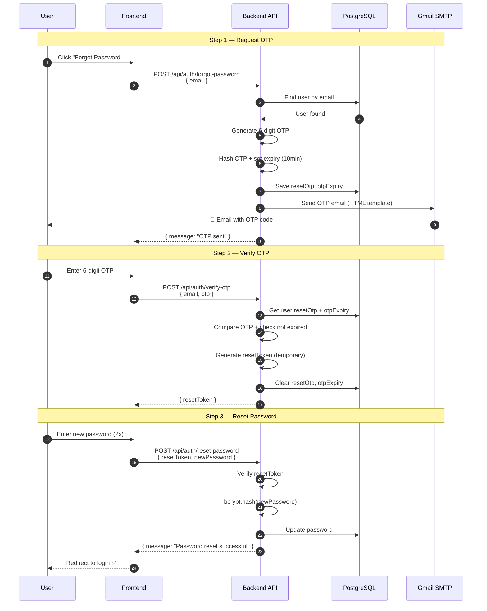

---

## 6. RBAC Authorization Flow

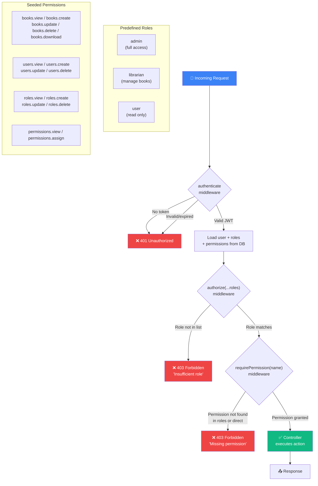

---

## 7. File Upload & Storage Flow

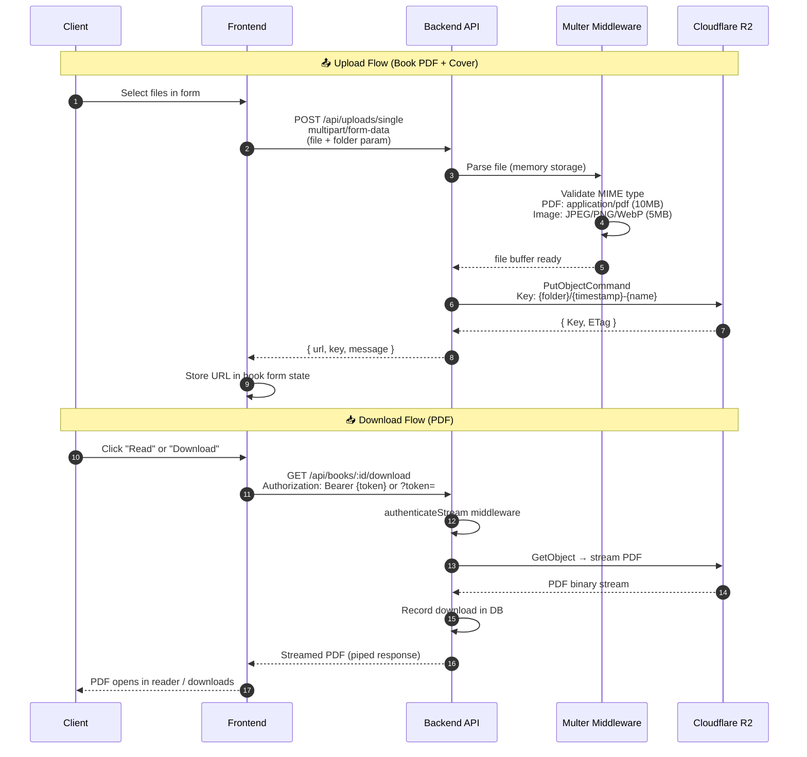

---

## 8. PDF Reading Flow

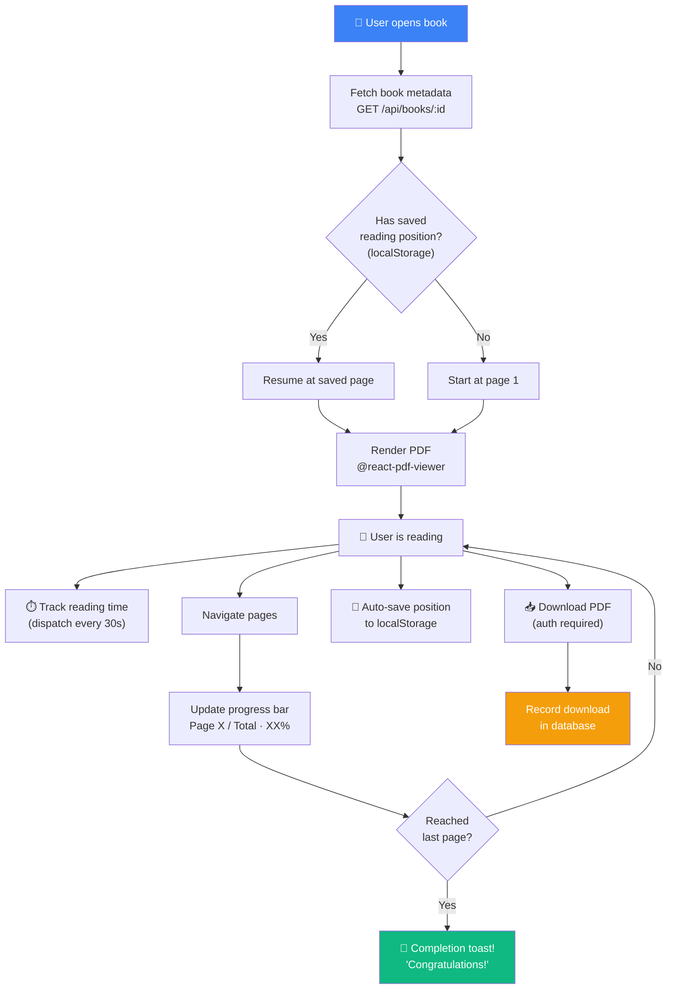

---

## 9. AI Recommendation Flow

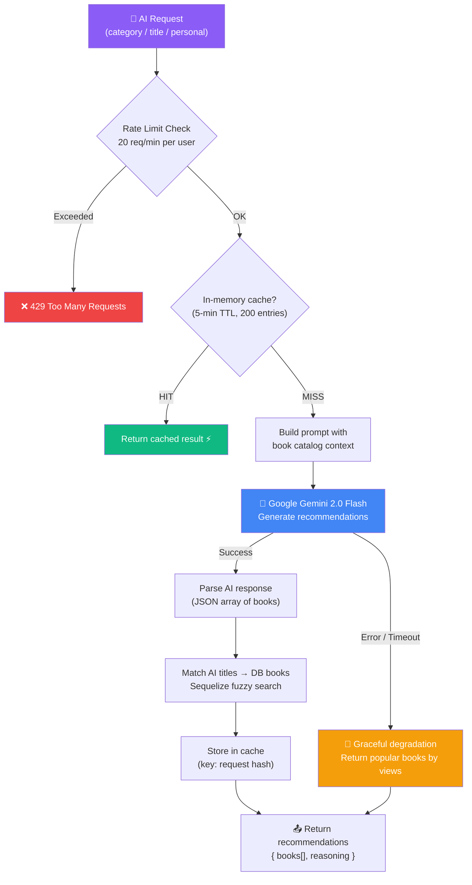

---

## 10. API Route Structure

```mermaid
graph LR
    API["/api"] --> AUTH["/auth"]
    API --> BOOKS["/books"]
    API --> USERS["/users"]
    API --> ROLES["/roles"]
    API --> PERMS["/permissions"]
    API --> CAT["/categories"]
    API --> DEPT["/departments"]
    API --> MT["/material-types"]
    API --> PUB["/publishers"]
    API --> AUT["/authors"]
    API --> EDT["/editors"]
    API --> UPL["/uploads"]
    API --> STAT["/stats"]
    API --> ACT["/activities"]
    API --> AI["/ai/recommendations"]
    API --> SET["/settings"]
    API --> DL["/downloads"]
    API --> REV["/reviews"]
    API --> PUSH["/push"]
    API --> FB["/feedback"]

    AUTH --> A1["POST /register"]
    AUTH --> A2["POST /login"]
    AUTH --> A3["POST /refresh"]
    AUTH --> A4["POST /logout"]
    AUTH --> A5["GET /me  ·  GET /profile"]
    AUTH --> A6["PATCH /profile"]
    AUTH --> A7["POST /avatar  ·  GET /avatar"]
    AUTH --> A8["PUT /change-password"]
    AUTH --> A9["POST /forgot-password"]
    AUTH --> A10["POST /verify-otp"]
    AUTH --> A11["POST /reset-password"]
    AUTH --> A12["POST /2fa/setup  ·  /2fa/verify<br/>/2fa/disable  ·  /2fa/status"]
    AUTH --> A13["GET /google  ·  GET /facebook<br/>GET /github  (OAuth)"]

    BOOKS --> B1["GET / (list + search + filter)"]
    BOOKS --> B2["GET /:id  ·  GET /:id/summary"]
    BOOKS --> B3["POST / (create)"]
    BOOKS --> B4["PUT /:id (update)"]
    BOOKS --> B5["DELETE /:id (soft-delete)"]
    BOOKS --> B6["GET /:id/cover"]
    BOOKS --> B7["GET /:id/stream (public PDF proxy)"]
    BOOKS --> B8["GET /:id/pdf-url  ·  /video-url  ·  /audio-url"]
    BOOKS --> B9["GET /:id/download (auth + record)"]
    BOOKS --> B10["POST /scan-search (AI cover scan)"]
    BOOKS --> B11["GET /:bookId/reviews  ·  POST /:bookId/reviews"]

    AI --> AI1["GET / (by category or bookTitle or userId)"]
    AI --> AI2["GET /trending"]
    AI --> AI3["GET /similar/:bookId"]
    AI --> AI4["POST /personalized"]
    AI --> AI5["POST /chat"]

    UPL --> U1["POST /single"]
    UPL --> U2["POST /multiple"]
    UPL --> U3["DELETE /delete"]

    style API fill:#3b82f6,color:#fff
    style AUTH fill:#ef4444,color:#fff
    style BOOKS fill:#10b981,color:#fff
    style AI fill:#8b5cf6,color:#fff
    style UPL fill:#f97316,color:#fff
    style REV fill:#06b6d4,color:#fff
    style FB fill:#f59e0b,color:#fff
```

---

## 11. Admin Dashboard — Page Structure

```mermaid
graph TD
    ROOT["🖥️ Admin Dashboard<br/>admin-elibrary.samnangchan.shop"] --> LOGIN["/login<br/>Authentication"]
    ROOT --> DASH["/(dashboard)"]

    DASH --> OV["/overview<br/>📊 Stats · Charts · Activity"]
    DASH --> BK["/books<br/>📚 Book Management"]
    DASH --> US["/users<br/>👥 User Management"]
    DASH --> PR["/profile<br/>👤 My Profile"]
    DASH --> BL["/billing<br/>💳 Billing (placeholder)"]

    BK --> BK_LIST["Book List<br/>TanStack Table · Search · Filter"]
    BK --> BK_NEW["/books/new<br/>Create Book Form"]
    BK --> BK_EDIT["/books/:id/edit<br/>Edit Book Form"]
    BK --> CAT_M["/books/categories<br/>Category Manager"]
    BK --> DEPT_M["/books/departments<br/>Department Manager"]
    BK --> MT_M["/books/material-types<br/>Material Type Manager"]
    BK --> PUB_M["/books/publishers<br/>Publisher Manager"]
    BK --> AUT_M["/books/authors<br/>Author Manager"]
    BK --> EDT_M["/books/editors<br/>Editor Manager"]

    US --> US_LIST["User List<br/>Table · Search"]
    US --> US_NEW["/users/new<br/>Create User"]
    US --> US_EDIT["/users/:id/edit<br/>Edit User + Roles"]
    US --> ROLE_M["/users/roles<br/>Role Manager"]
    US --> PERM_M["/users/permissions<br/>Permission Manager"]

    OV --> OV_CARDS["Stat Cards<br/>Books · Theses · Members"]
    OV --> OV_CHART["Charts<br/>Upload Trends · Categories"]
    OV --> OV_ACT["Recent Activities<br/>Feed + Time Filter"]

    style ROOT fill:#8b5cf6,color:#fff
    style LOGIN fill:#ef4444,color:#fff
    style OV fill:#3b82f6,color:#fff
    style BK fill:#10b981,color:#fff
    style US fill:#f59e0b,color:#fff
```

---

## 12. Student Frontend — Page Structure

```mermaid
graph TD
    ROOT["📱 Student Frontend<br/>frontend.samnangchan.shop"] --> HOME["/<br/>🏠 Home Page"]
    ROOT --> AUTH_G["/auth"]
    ROOT --> BOOKS_G["/books"]
    ROOT --> LIB["/library<br/>📚 Personal Library"]
    ROOT --> PROF["/profile<br/>👤 Profile"]
    ROOT --> ABOUT["/about<br/>ℹ️ About"]
    ROOT --> CONTACT["/contact<br/>📧 Contact"]

    HOME --> HERO["Hero Section<br/>Search · Book Marquee"]
    HOME --> FEAT["Featured Books<br/>Top 15 · Rank Badges"]
    HOME --> STATS["Statistics<br/>Animated Counters"]
    HOME --> CATS["Categories<br/>Browse by Subject"]
    HOME --> TEST["Testimonials<br/>Carousel"]
    HOME --> CTA["CTA Section"]

    AUTH_G --> SIGNIN["/auth/signin"]
    AUTH_G --> SIGNUP["/auth/signup"]
    AUTH_G --> FORGOT["/auth/forgot-password<br/>3-Step OTP Flow"]

    BOOKS_G --> CATALOG["/books<br/>Catalog · Grid/List"]
    BOOKS_G --> DETAIL["/books/:id<br/>Book Detail"]
    BOOKS_G --> READER["/books/:id/read<br/>📖 PDF Reader"]

    LIB --> FAV["⭐ Favorites Tab"]
    LIB --> HIST["📜 History Tab"]
    LIB --> PROG["📊 Progress Tab"]

    PROF --> P_VIEW["View Profile"]
    PROF --> P_EDIT["Edit Profile + Avatar"]
    PROF --> P_PASS["Change Password"]

    style ROOT fill:#3b82f6,color:#fff
    style HOME fill:#10b981,color:#fff
    style AUTH_G fill:#ef4444,color:#fff
    style BOOKS_G fill:#8b5cf6,color:#fff
    style LIB fill:#f59e0b,color:#fff
    style READER fill:#06b6d4,color:#fff
```

---

## 13. Redux State Architecture

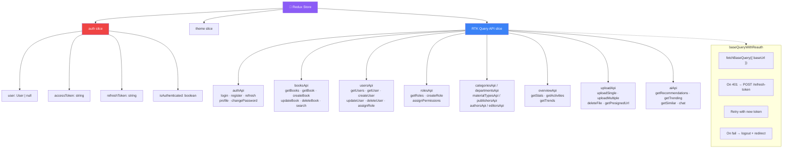

---

## 14. Sprint & Phase Timeline

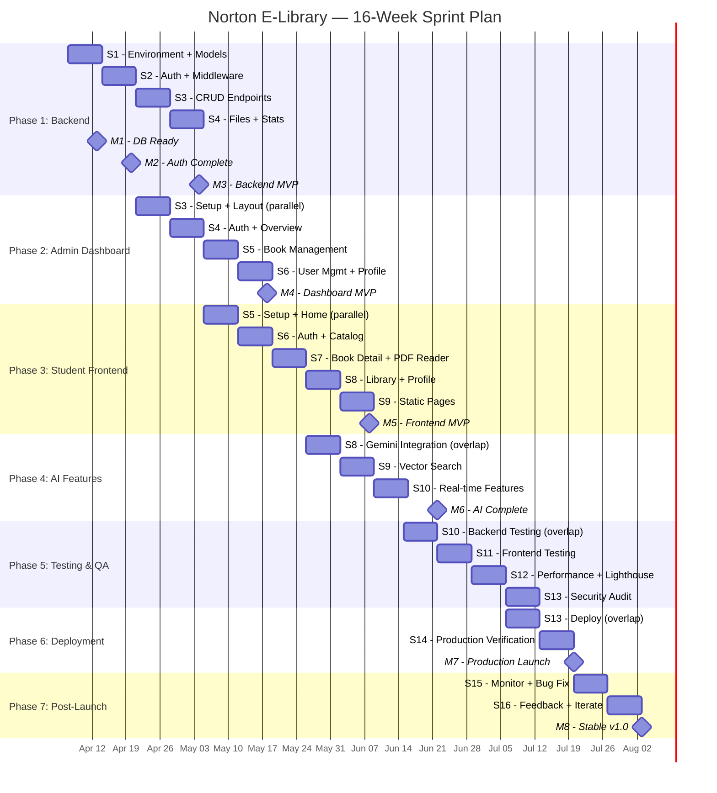

---

## 15. Data Flow — Book CRUD

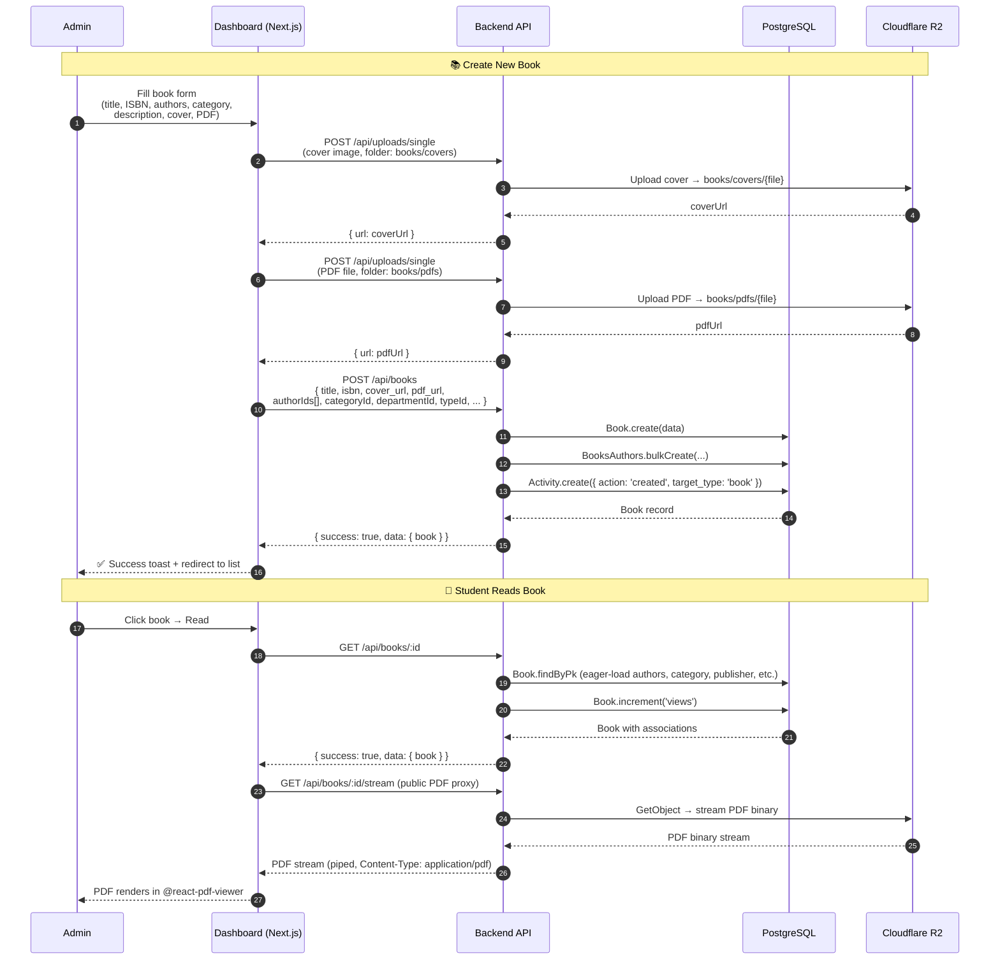

---

## 16. Two-Factor Authentication Flow

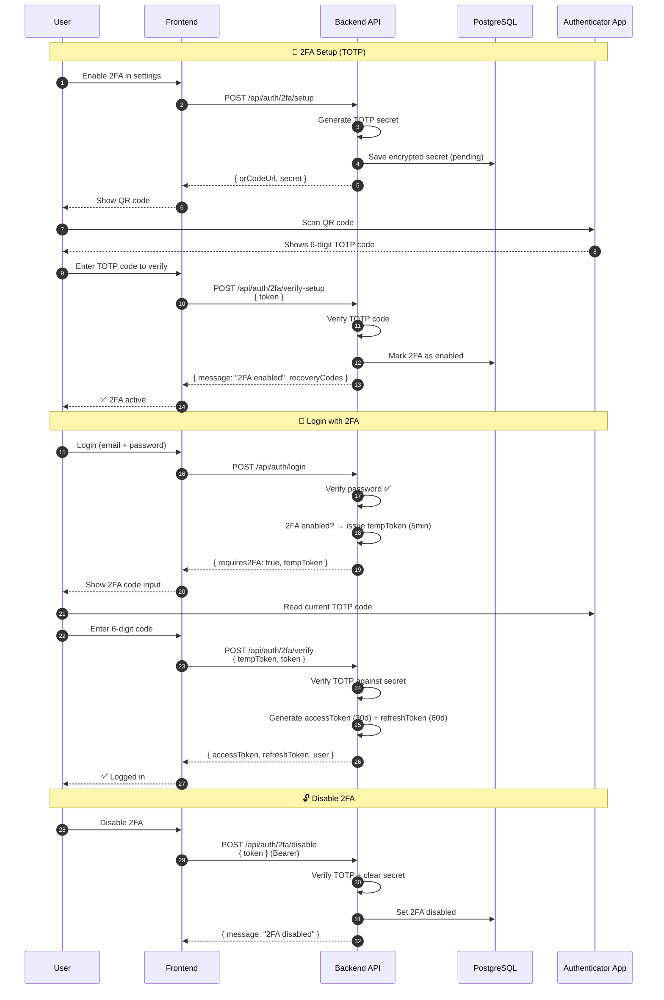

---

## 17. Reviews & Feedback Flow

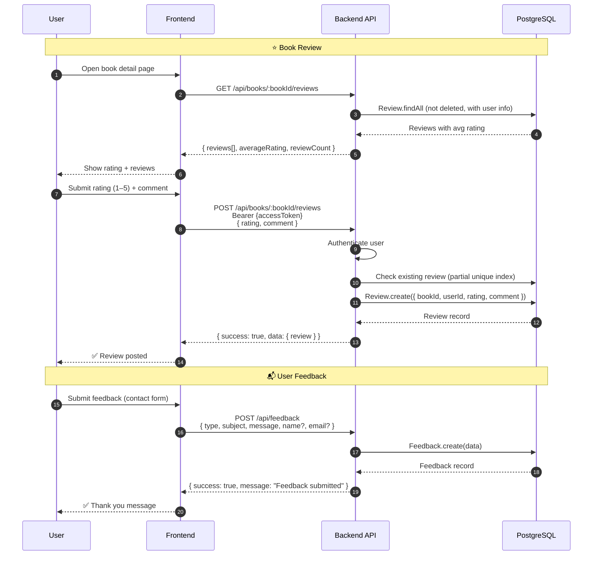

---

---

## 18. Use Case Diagram

> តួអង្គ (Actors): **Student / User**, **Librarian**, **Admin**  
> Use-case ខាងក្រោមបង្ហាញពីសិទ្ធិ និងសកម្មភាពរបស់តួអង្គនីមួយៗក្នុងប្រព័ន្ធបណ្ណាល័យ Norton E-Library។

```mermaid
flowchart LR
    STU(["👩‍🎓 Student / User"])
    LIB(["📚 Librarian"])
    ADM(["👨‍💼 Admin"])

    subgraph AUTH_UC["🔐 Authentication"]
        UC1["Register / Sign Up"]
        UC2["Login (email · username · studentId)"]
        UC3["Forgot Password (OTP via Email)"]
        UC4["Change Password"]
        UC5["OAuth Login (Google · Facebook · GitHub)"]
        UC6["Two-Factor Authentication (TOTP)"]
    end

    subgraph BOOK_UC["📖 Book Access"]
        UC7["Browse & Search Books"]
        UC8["Filter by Category / Department / Type"]
        UC9["View Book Detail & Metadata"]
        UC10["Read PDF Online"]
        UC11["Download PDF (authenticated)"]
        UC12["Add to Favorites"]
        UC13["View Personal Library & History"]
        UC14["Track Reading Progress"]
        UC15["Get AI Book Recommendations"]
        UC16["Visual Book Cover Scan Search"]
    end

    subgraph SOCIAL_UC["💬 Social & Feedback"]
        UC17["Submit Book Review & Rating"]
        UC18["Submit Feedback / Bug Report"]
        UC19["Subscribe to Push Notifications"]
        UC20["Share Book Link"]
    end

    subgraph PROFILE_UC["👤 Profile"]
        UC21["View / Edit Profile"]
        UC22["Upload Avatar"]
        UC23["View Roles & Permissions"]
    end

    subgraph LIB_UC["🗂️ Library Management (Librarian)"]
        UC24["Create / Edit / Delete Books"]
        UC25["Upload Book Cover & PDF to R2"]
        UC26["Manage Categories · Departments · Material Types"]
        UC27["Manage Authors · Editors · Publishers"]
        UC28["View Download Statistics"]
        UC29["View Activity Log"]
        UC30["Manage Feedback"]
        UC31["Scan Student Code ID (Check-in / Check-out)"]  
    end

    subgraph ADMIN_UC["⚙️ Administration (Admin Only)"]
        UC32["Manage Users (CRUD + Roles + Permissions)"]
        UC33["Manage Roles & Permissions"]
        UC34["View Full Dashboard Analytics"]
        UC35["Configure System Settings"]
        UC36["Approve Students into Library System"]
        UC37["Review Staff Activity & Work"]
        UC38["Review Book Return Approvals"]
        UC39["Review Library Payment Records"]
        UC40["Review Student Check-in / Check-out Data"]
    end

    %% Student associations
    STU --- UC1 & UC2 & UC3 & UC4 & UC5 & UC6
    STU --- UC7 & UC8 & UC9 & UC10 & UC11 & UC12 & UC13 & UC14 & UC15 & UC16
    STU --- UC17 & UC18 & UC19 & UC20
    STU --- UC21 & UC22 & UC23

    %% Librarian extends Student + adds Library Mgmt
    LIB --- UC1 & UC2 & UC4 & UC6
    LIB --- UC7 & UC9 & UC10 & UC11
    LIB --- UC21 & UC22
    LIB --- UC24 & UC25 & UC26 & UC27 & UC28 & UC29 & UC30 & UC31

    %% Admin extends Librarian + adds Administration
    ADM --- UC1 & UC2 & UC4 & UC6
    ADM --- UC7 & UC9 & UC10 & UC11
    ADM --- UC21 & UC22
    ADM --- UC24 & UC25 & UC26 & UC27 & UC28 & UC29 & UC30 & UC31
    ADM --- UC32 & UC33 & UC34 & UC35 & UC36 & UC37 & UC38 & UC39 & UC40

    style STU fill:#3b82f6,stroke:#1d4ed8,color:#fff
    style LIB fill:#10b981,stroke:#059669,color:#fff
    style ADM fill:#8b5cf6,stroke:#6d28d9,color:#fff
    style AUTH_UC fill:#fef9c3,stroke:#ca8a04
    style BOOK_UC fill:#dcfce7,stroke:#16a34a
    style SOCIAL_UC fill:#e0f2fe,stroke:#0284c7
    style PROFILE_UC fill:#fce7f3,stroke:#be185d
    style LIB_UC fill:#fff7ed,stroke:#c2410c
    style ADMIN_UC fill:#f3e8ff,stroke:#7c3aed
```

### ពន្យល់ Use Case តាមតួអង្គ (Actor Descriptions)

| Actor | ភាសាខ្មែរ | Use Cases |
|---|---|---|
| **Student / User** | និស្សិត / អ្នកប្រើប្រាស់ | UC1–UC23 — ចូលប្រើ, អាន, ទាញយក, ស្វែងរក, សម្គាល់ប្រវត្តិ, Review |
| **Librarian** | បណ្ណារក្ស | UC1–UC4, UC6–UC11, UC21–UC31 — គ្រប់គ្រងសៀវភៅ, CategMap, Upload, Scan Code ID |
| **Admin** | អ្នកគ្រប់គ្រង | UC1–UC4, UC6–UC11, UC21–UC40 — គ្រប់ UC ទាំងអស់ + Users + Roles + Analytics + Approve |

---

## 19. DFD Level 0 — Context Diagram

> DFD Level 0 (Context Diagram) បង្ហាញពីប្រព័ន្ធ Norton E-Library ជាដំណើរការ (Process) តែមួយ  
> ជាមួយនឹងតួអង្គខាងក្រៅ (External Entities) ទាំងអស់ ដែលបញ្ជូន និងទទួលទិន្នន័យ។

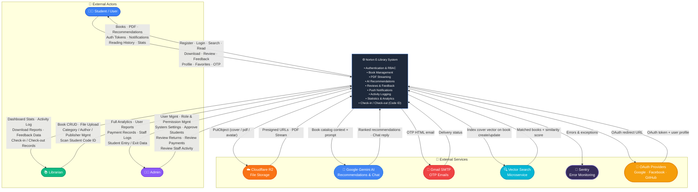

### ពន្យល់ DFD Level 0 — Data Flows

| Flow | From | To | Data |
|---|---|---|---|
| ចូលប្រព័ន្ធ (Login) | Student / Librarian / Admin | System | Credentials, Token refresh |
| ស្វែងរក & អានសៀវភៅ | Student | System | Search query, Book ID |
| ទទួលសៀវភៅ | System | Student | Book metadata, PDF stream, Cover URL |
| គ្រប់គ្រងសៀវភៅ (CRUD) | Librarian / Admin | System | Book data, File uploads |
| ចូល / ចេញបណ្ណាល័យ (Process 14) | Librarian (Scan) | System | Student Code ID, Timestamp |
| យល់ព្រមនិស្សិត (Process 10) | Admin | System | Student approval decision |
| ពិនិត្យការសងសៀវភៅ (Process 11) | Admin | System | Return confirmation |
| ពិនិត្យការបង់លុយ (Process 12) | Admin | System | Payment record review |
| ពិនិត្យទិន្នន័យចូល/ចេញ (Process 13) | Admin | System | Check-in/out log query |
| រក្សាទុកឯកសារ | System | Cloudflare R2 | PDF, Cover image, Avatar |
| AI Recommendations | System | Google Gemini | Book catalog → ranked list |
| OTP Email | System | Gmail SMTP | 6-digit OTP for password reset |
| Vector Search | System | Vector Microservice | Cover image embed → matches |

---

> **📌 Rendering Tips:**  
> - **VS Code:** Install the "Markdown Preview Mermaid Support" extension  
> - **GitHub:** Mermaid diagrams render natively in `.md` files  
> - **Online:** Paste diagrams at [mermaid.live](https://mermaid.live)

> **© 2026 Norton University E-Library · Phnom Penh, Cambodia**
