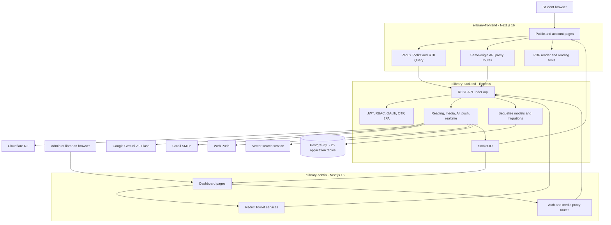
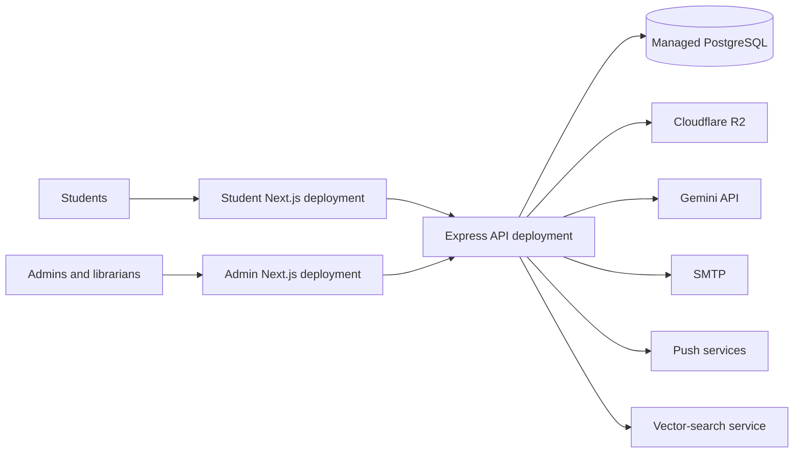
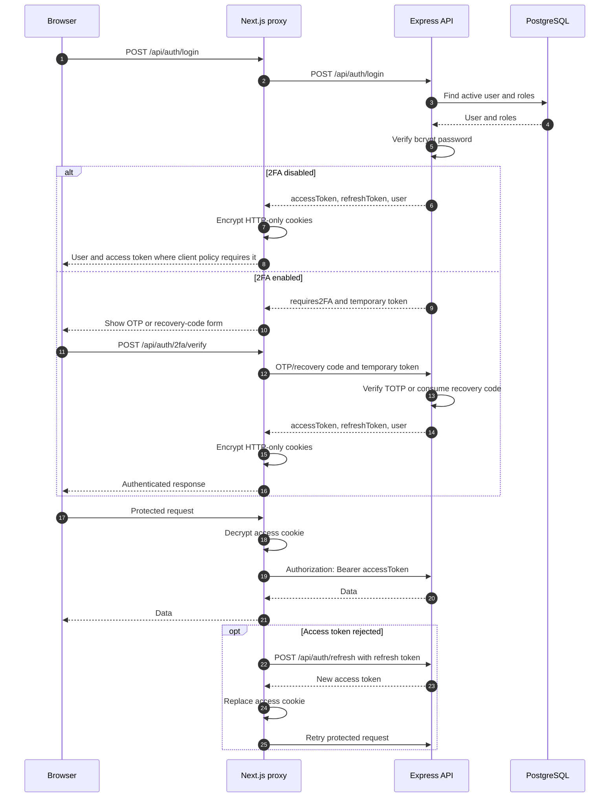
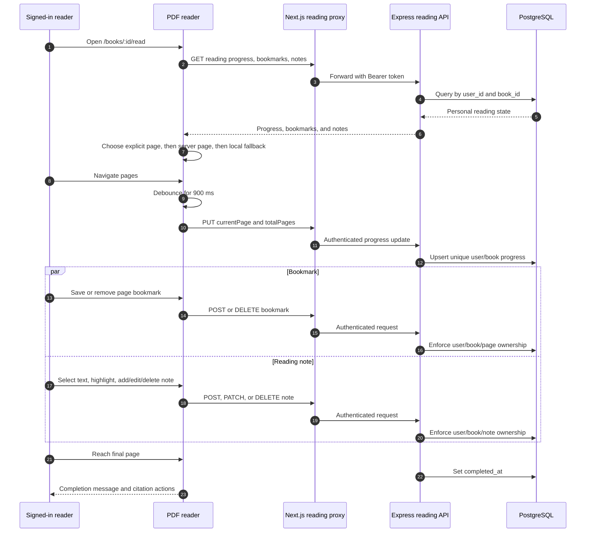
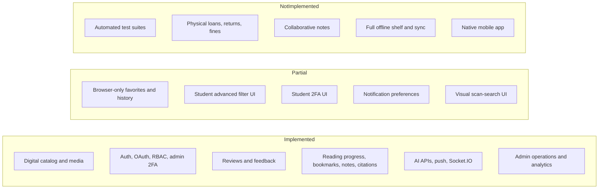

# Norton E-Library — Current Architecture Diagrams

> **Version:** 3.0
> **Last updated:** August 2, 2026
> **Scope:** Current local code in the backend, admin dashboard, and student frontend
> **Rendering:** Mermaid-compatible Markdown viewer

## Table of contents

1. [System architecture](#1-system-architecture)
2. [Deployment topology](#2-deployment-topology)
3. [Database relationship paths](#3-database-relationship-paths)
4. [Entity-relationship diagram](#4-entity-relationship-diagram)
5. [Authentication and 2FA](#5-authentication-and-2fa)
6. [Reading progress, bookmarks, and notes](#6-reading-progress-bookmarks-and-notes)
7. [API route topology](#7-api-route-topology)
8. [Student route structure](#8-student-route-structure)
9. [Admin route structure](#9-admin-route-structure)
10. [Client state ownership](#10-client-state-ownership)
11. [Book and media flow](#11-book-and-media-flow)
12. [Implemented boundary](#12-implemented-boundary)

## 1. System architecture


```mermaid
flowchart TB
    Student[Student browser]
    Staff[Admin or librarian browser]

    subgraph StudentApp[elibrary-frontend - Next.js 16]
        StudentPages[Public and account pages]
        StudentProxy[Same-origin API proxy routes]
        StudentRedux[Redux Toolkit and RTK Query]
        Reader[PDF reader and reading tools]
    end

    subgraph AdminApp[elibrary-admin - Next.js 16]
        AdminPages[Dashboard pages]
        AdminProxy[Auth and media proxy routes]
        AdminRedux[Redux Toolkit services]
    end

    subgraph Backend[elibrary-backend - Express]
        API[REST API under /api]
        Auth[JWT, RBAC, OAuth, OTP, 2FA]
        Services[Reading, media, AI, push, realtime]
        ORM[Sequelize models and migrations]
        Socket[Socket.IO]
    end

    DB[(PostgreSQL - 25 application tables)]
    R2[Cloudflare R2]
    Gemini[Google Gemini 2.0 Flash]
    SMTP[Gmail SMTP]
    Push[Web Push]
    Vector[Vector search service]

    Student --> StudentPages
    StudentPages --> StudentRedux
    StudentPages --> StudentProxy
    StudentPages --> Reader
    Staff --> AdminPages
    AdminPages --> AdminRedux
    AdminPages --> AdminProxy

    StudentProxy --> API
    StudentRedux --> API
    AdminProxy --> API
    AdminRedux --> API
    API --> Auth
    API --> Services
    API --> ORM
    ORM --> DB
    Services --> R2
    Services --> Gemini
    Services --> SMTP
    Services --> Push
    Services --> Vector
    Services --> Socket
    Socket --> StudentPages
    Socket --> AdminPages
```

## 2. Deployment topology


```mermaid
flowchart LR
    U1[Students] --> SF[Student Next.js deployment]
    U2[Admins and librarians] --> AD[Admin Next.js deployment]
    SF --> API[Express API deployment]
    AD --> API
    API --> PG[(Managed PostgreSQL)]
    API --> R2[Cloudflare R2]
    API --> GEM[Gemini API]
    API --> MAIL[SMTP]
    API --> WEBPUSH[Push services]
    API --> VECTOR[Vector-search service]
```

The repositories contain Vercel/Render/Docker-oriented configuration, but this
diagram intentionally does not claim that any external deployment is currently
healthy; live availability requires a separate environment check.

## 3. Database relationship paths

```text
User (Sequelize model) → users

users
├── users_roles → roles
│   └── roles_permissions → permissions
└── users_permissions → permissions

books
├── category_id → categories
├── department_id → departments
├── type_id → material_types
├── publisher_id → publishers
├── books_authors → authors
├── books_editors → editors
└── publishers_books → publishers

users → books (through user-to-book activity tables)
├── users → downloads → books
├── users → bookmarks → books
├── users → reading_progress → books
├── users → reading_notes → books
└── users → reviews → books

users
├── feedbacks (submitter and resolver links)
├── activities
└── push_subscriptions
```

`users` and `books` do not have a direct foreign key. User/book behavior is
represented by the five interaction tables shown above.

## 4. Entity-relationship diagram


```mermaid
erDiagram
    users {
        bigint id PK
        string avatar
        string username UK
        string email UK
        string password
        string oauth_provider
        string oauth_id
        string student_id UK
        text first_name
        text last_name
        boolean is_active
        boolean is_deleted
        boolean two_factor_enabled
        string two_factor_secret
        text face_descriptor
        text recovery_codes
        datetime created_at
        datetime updated_at
    }

    roles {
        bigint id PK
        string name UK
        text description
    }

    permissions {
        bigint id PK
        string name UK
        text description
    }

    users_roles {
        bigint user_id PK, FK
        bigint role_id PK, FK
    }

    roles_permissions {
        bigint role_id PK, FK
        bigint permission_id PK, FK
    }

    users_permissions {
        bigint user_id PK, FK
        bigint permission_id PK, FK
    }

    categories {
        int id PK
        string name UK
        string name_kh
        text description
    }

    publishers {
        int id PK
        string name UK
        string name_kh
        text address
        string contact_email
    }

    departments {
        int id PK
        string code UK
        string name UK
        string name_kh
        text description
    }

    material_types {
        int id PK
        string name UK
        string name_kh
        text description
    }

    authors {
        bigint id PK
        string name UK
        string name_kh
        text biography
        string website
    }

    editors {
        bigint id PK
        string name UK
        string name_kh
        text biography
        string website
    }

    books {
        bigint id PK
        string title
        string title_kh
        string isbn UK
        int publication_year
        text description
        string cover_url
        string pdf_url
        jsonb pdf_urls
        string video_url
        string audio_url
        int pages
        int views
        int downloads
        int shares
        string language
        int publisher_id FK
        int category_id FK
        int department_id FK
        int type_id FK
        boolean is_active
        boolean is_deleted
        datetime created_at
        datetime updated_at
    }

    books_authors {
        bigint book_id PK, FK
        bigint author_id PK, FK
        boolean is_primary_author
    }

    books_editors {
        bigint book_id PK, FK
        bigint editor_id PK, FK
    }

    publishers_books {
        bigint publisher_id PK, FK
        bigint book_id PK, FK
    }

    downloads {
        bigint id PK
        bigint user_id FK
        bigint book_id FK
        datetime downloaded_at
        string ip_address
    }

    bookmarks {
        bigint id PK
        bigint user_id FK
        bigint book_id FK
        int page_number
        string title
        datetime created_at
        datetime updated_at
    }

    reading_progress {
        bigint id PK
        bigint user_id FK
        bigint book_id FK
        int current_page
        int total_pages
        decimal progress_percentage
        datetime last_read_at
        datetime completed_at
        datetime created_at
        datetime updated_at
    }

    reading_notes {
        bigint id PK
        bigint user_id FK
        bigint book_id FK
        int page_number
        text selected_text
        text note_text
        string highlight_color
        datetime created_at
        datetime updated_at
    }

    reviews {
        bigint id PK
        bigint book_id FK
        bigint user_id FK
        int rating
        text comment
        boolean is_deleted
        datetime created_at
        datetime updated_at
    }

    activities {
        bigint id PK
        bigint user_id FK
        string action
        bigint target_id
        string target_name
        string target_type
        json metadata
        datetime created_at
    }

    settings {
        string key PK
        text value
        string group
        string type
        datetime created_at
        datetime updated_at
    }

    feedbacks {
        bigint id PK
        bigint user_id FK
        feedback_type type
        string subject
        text message
        string name
        string email
        int rating
        feedback_status status
        text admin_notes
        bigint resolved_by FK
        datetime resolved_at
        datetime created_at
        datetime updated_at
    }

    push_subscriptions {
        bigint id PK
        bigint user_id FK
        text endpoint UK
        json keys
        datetime created_at
        datetime updated_at
    }

    users ||--o{ users_roles : has
    roles ||--o{ users_roles : assigned
    roles ||--o{ roles_permissions : grants
    permissions ||--o{ roles_permissions : granted_by
    users ||--o{ users_permissions : direct
    permissions ||--o{ users_permissions : assigned

    categories ||--o{ books : categorizes
    departments ||--o{ books : owns
    material_types ||--o{ books : classifies
    publishers o|--o{ books : primary_publisher

    books ||--o{ books_authors : has
    authors ||--o{ books_authors : writes
    books ||--o{ books_editors : has
    editors ||--o{ books_editors : edits
    books ||--o{ publishers_books : has
    publishers ||--o{ publishers_books : publishes

    users ||--o{ downloads : downloads
    books ||--o{ downloads : downloaded
    users ||--o{ bookmarks : saves
    books ||--o{ bookmarks : bookmarked
    users ||--o{ reading_progress : tracks
    books ||--o{ reading_progress : tracked
    users ||--o{ reading_notes : writes
    books ||--o{ reading_notes : annotated
    users ||--o{ reviews : writes
    books ||--o{ reviews : reviewed

    users o|--o{ activities : performs
    users o|--o{ feedbacks : submits
    users o|--o{ feedbacks : resolves
    users o|--o{ push_subscriptions : subscribes
```

## 5. Authentication and 2FA


```mermaid
sequenceDiagram
    autonumber
    participant B as Browser
    participant N as Next.js proxy
    participant A as Express API
    participant D as PostgreSQL

    B->>N: POST /api/auth/login
    N->>A: POST /api/auth/login
    A->>D: Find active user and roles
    D-->>A: User and roles
    A->>A: Verify bcrypt password

    alt 2FA disabled
        A-->>N: accessToken, refreshToken, user
        N->>N: Encrypt HTTP-only cookies
        N-->>B: User and access token where client policy requires it
    else 2FA enabled
        A-->>N: requires2FA and temporary token
        N-->>B: Show OTP or recovery-code form
        B->>N: POST /api/auth/2fa/verify
        N->>A: OTP/recovery code and temporary token
        A->>A: Verify TOTP or consume recovery code
        A-->>N: accessToken, refreshToken, user
        N->>N: Encrypt HTTP-only cookies
        N-->>B: Authenticated response
    end

    B->>N: Protected request
    N->>N: Decrypt access cookie
    N->>A: Authorization: Bearer accessToken
    A-->>N: Data
    N-->>B: Data

    opt Access token rejected
        N->>A: POST /api/auth/refresh with refresh token
        A-->>N: New access token
        N->>N: Replace access cookie
        N->>A: Retry protected request
    end
```

The admin dashboard additionally keeps the access token in Redux memory for
direct Express calls. Refresh tokens remain HTTP-only cookie data.

## 6. Reading progress, bookmarks, and notes


```mermaid
sequenceDiagram
    autonumber
    participant U as Signed-in reader
    participant R as PDF reader
    participant P as Next.js reading proxy
    participant A as Express reading API
    participant D as PostgreSQL

    U->>R: Open /books/:id/read
    R->>P: GET reading progress, bookmarks, notes
    P->>A: Forward with Bearer token
    A->>D: Query by user_id and book_id
    D-->>A: Personal reading state
    A-->>R: Progress, bookmarks, and notes

    R->>R: Choose explicit page, then server page, then local fallback
    U->>R: Navigate pages
    R->>R: Debounce for 900 ms
    R->>P: PUT currentPage and totalPages
    P->>A: Authenticated progress update
    A->>D: Upsert unique user/book progress

    par Bookmark
        U->>R: Save or remove page bookmark
        R->>P: POST or DELETE bookmark
        P->>A: Authenticated request
        A->>D: Enforce user/book/page ownership
    and Reading note
        U->>R: Select text, highlight, add/edit/delete note
        R->>P: POST, PATCH, or DELETE note
        P->>A: Authenticated request
        A->>D: Enforce user/book/note ownership
    end

    U->>R: Reach final page
    A->>D: Set completed_at
    R-->>U: Completion message and citation actions
```

## 7. API route topology

```mermaid
flowchart LR
    API[/api]
    API --> AUTH[/auth]
    API --> USERS[/users]
    API --> ROLES[/roles]
    API --> PERMS[/permissions]
    API --> BOOKS[/books]
    API --> LIB[/library]
    API --> META[Metadata CRUD]
    API --> UPLOADS[/uploads]
    API --> DOWNLOADS[/downloads]
    API --> STATS[/stats]
    API --> SETTINGS[/settings]
    API --> ACTIVITIES[/activities]
    API --> REVIEWS[/reviews]
    API --> FEEDBACK[/feedback]
    API --> PUSH[/push]
    API --> AI[/ai/recommendations]

    AUTH --> AUTH1[Password, refresh, profile, reset]
    AUTH --> AUTH2[2FA and face endpoints]
    AUTH --> AUTH3[Google, Facebook, GitHub OAuth]

    BOOKS --> BOOK1[Catalog CRUD and media]
    BOOKS --> BOOK2[Summary, sharing, scan search]
    BOOKS --> BOOK3[Reviews]
    BOOKS --> BOOK4[Progress, bookmarks, notes]
    LIB --> LIB1[Aggregated reading progress]

    META --> CAT[/categories]
    META --> AUTHORS[/authors]
    META --> EDITORS[/editors]
    META --> PUBS[/publishers]
    META --> TYPES[/material-types]
    META --> DEPTS[/departments]
```

## 8. Student route structure

```text
elibrary-frontend/app
├── page.tsx
├── books
│   ├── page.tsx
│   └── [id]
│       ├── page.tsx
│       └── read/page.tsx
├── authors
│   ├── page.tsx
│   └── [authorId]/page.tsx
├── videos/page.tsx
├── audios/page.tsx
├── library/page.tsx
├── profile/page.tsx
├── about/page.tsx
├── contact/page.tsx
├── auth
│   ├── signin/page.tsx
│   ├── signup/page.tsx
│   ├── forgot-password/page.tsx
│   ├── reset-password/page.tsx
│   └── callback/page.tsx
└── api
    ├── auth/*
    ├── books/[id]/{reading-progress,bookmarks,notes,media,reviews,share}
    ├── library/reading-progress
    ├── categories
    ├── reviews/*
    ├── feedback/*
    ├── push/*
    ├── stats
    └── users/[id]/avatar
```

## 9. Admin route structure

```text
elibrary-admin/src/app
├── (auth)
│   ├── login/page.tsx
│   └── forgot-password/page.tsx
├── dashboard
│   ├── overview/*
│   ├── books
│   │   ├── page.tsx
│   │   ├── [bookId]/page.tsx
│   │   ├── [bookId]/read/page.tsx
│   │   ├── categories/page.tsx
│   │   ├── departments/page.tsx
│   │   ├── material-types/page.tsx
│   │   ├── publishers/page.tsx
│   │   ├── authors/page.tsx
│   │   └── editors/page.tsx
│   ├── users
│   │   ├── [[...rest]]/page.tsx
│   │   ├── roles/page.tsx
│   │   └── permissions/page.tsx
│   ├── downloads/page.tsx
│   ├── reviews/page.tsx
│   ├── feedback/page.tsx
│   ├── settings/page.tsx
│   ├── profile/[[...profile]]/page.tsx
│   └── audit-logs/page.tsx
└── api
    ├── auth/*
    ├── auth/2fa/[...path]
    ├── books/[id]/{cover,pdf-url,stream,download}
    └── users/[id]/avatar
```

## 10. Client state ownership

| State | Student frontend | Admin dashboard | Durable source |
|---|---|---|---|
| Access token | HTTP-only cookie through proxies | Cookie plus Redux memory | JWT, not database session |
| Refresh token | HTTP-only cookie | HTTP-only cookie | JWT, not exposed to browser JS |
| Current user | RTK Query/auth state | Redux auth state | `users` plus RBAC relations |
| Favorites | Redux + per-user local storage | Not applicable | Browser only |
| Recent history | Redux + per-user local storage | Not applicable | Browser only |
| Reading progress | RTK Query plus local fallback | Not applicable | `reading_progress` |
| Page bookmarks | RTK Query | Not applicable | `bookmarks` |
| Notes/highlights | RTK Query | Not applicable | `reading_notes` |
| Catalog/reviews/feedback | RTK Query | Redux Toolkit services | PostgreSQL |
| Realtime notices | Socket provider | Notification slice/socket hook | Transient Socket.IO event |

## 11. Book and media flow

```mermaid
sequenceDiagram
    autonumber
    participant S as Admin or librarian
    participant D as Admin dashboard
    participant A as Express API
    participant R as Cloudflare R2
    participant P as PostgreSQL
    participant V as Vector service

    S->>D: Submit book form and optional media
    D->>A: POST or PUT multipart /api/books
    A->>A: Authenticate, authorize, validate MIME and classifications
    A->>R: Upload cover, PDF, video, audio
    R-->>A: Object keys/URLs
    A->>P: Create/update book and relations
    A->>V: Sync cover vector when available
    A-->>D: Book response

    participant U as Student
    U->>A: GET book metadata
    A->>P: Load book and associations; increment view asynchronously
    A-->>U: Book metadata
    U->>A: GET stream/download/signed media URL
    A->>R: Retrieve or sign object
    R-->>A: Stream/URL
    A-->>U: Media response
```

## 12. Implemented boundary


```mermaid
flowchart LR
    subgraph Implemented
        I1[Digital catalog and media]
        I2[Auth, OAuth, RBAC, admin 2FA]
        I3[Reviews and feedback]
        I4[Reading progress, bookmarks, notes, citations]
        I5[AI APIs, push, Socket.IO]
        I6[Admin operations and analytics]
    end

    subgraph Partial
        P1[Browser-only favorites and history]
        P2[Student advanced filter UI]
        P3[Student 2FA UI]
        P4[Notification preferences]
        P5[Visual scan-search UI]
    end

    subgraph NotImplemented
        N1[Automated test suites]
        N2[Physical loans, returns, fines]
        N3[Collaborative notes]
        N4[Full offline shelf and sync]
        N5[Native mobile app]
    end
```

See [PLAN.md](PLAN.md) and [TASKS.md](TASKS.md) for the prioritized hardening
work, including publisher route protection, environment-secret cleanup, and
automated tests.
